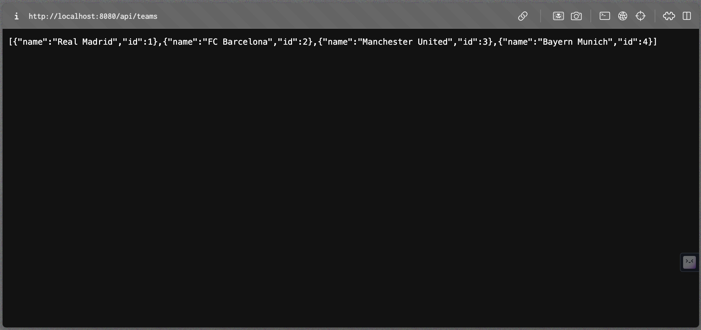
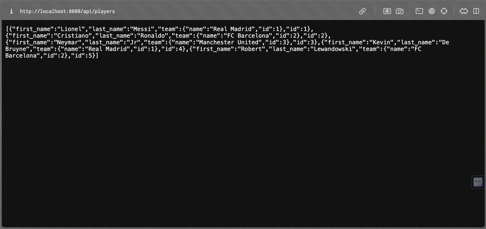
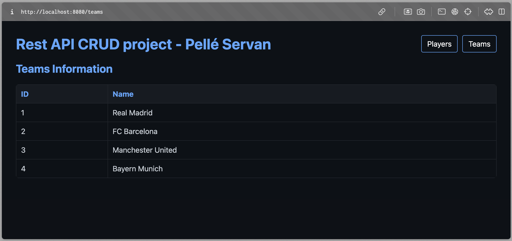

# Projet Spring Boot CRUD avec Thymeleaf

Ce projet est une application Spring Boot qui offre une API REST pour gérer les informations sur les équipes et les joueurs. L'application utilise une base de données H2 pour stocker les données et Thymeleaf pour créer une interface utilisateur simple.

## Configuration

- **Java:** Assurez-vous d'avoir Java installé sur votre machine. La version utilisée dans ce projet est Java 19.
- **Port:** L'application est configurée pour utiliser le port 8080 par défaut. Assurez-vous que ce port est disponible ou modifiez-le dans le fichier `application.properties` si nécessaire.

## Exécution du projet

1. Clonez le dépôt : `git clone https://github.com/votre-utilisateur/votre-projet.git`
2. Accédez au répertoire du projet : `cd votre-projet`
3. Exécutez l'application : `./mvnw spring-boot:run`

L'application sera accessible à l'adresse [http://localhost:8080](http://localhost:8080).

## API REST

L'API REST offre les fonctionnalités CRUD pour les entités "Team" et "Player". Voici quelques exemples d'utilisation :

### Peupler la base de données

Pour peupler notre base de données des fichiers **JSON** sont disponible dans `./API_REST/src/main/resources/data`. Les données contenus dans ces fichiers sont formater pour être correctement interprété par le projet : 

- **teams.jsp**
  ```json
  {"name": "Real Madrid"}

- **player.json**
  ```json
  {"first_name": "Lionel", "last_name": "Messi", "team": {"id": 1, "name": "Real Madrid"}}

Il est important de commencer par insérer des équipes si l'on veux ratacher des jeueurs à une équipe. Pour cela deux méthodes :

- POSTMAN :

Consulter la documentation [https://www.postman.com/api-documentation-tool/](https://www.postman.com/api-documentation-tool/).

Suivre les étape décrite dans cette vidéo :


### Récupération de données

- **Récupérer la liste des équipes :**
  ```bash
  curl http://localhost:8080/api/teams


*Récupération de la liste des équipes.*

- **Récupérer la liste des joueurs :**
  ```bash
  curl http://localhost:8080/api/players


*Récupération de la liste des joueurs.*

Pour une visualisation plus simple des données des styles ont été développer pour organiser les données. Ces tables sont disponible via :

- **Récupérer la liste des équipes dans :**
  ```bash
  curl http://localhost:8080/teams


*Récupération de la table des équipes.*

- **Récupérer la liste des joueurs :**
  ```bash
  curl http://localhost:8080/players


*Récupération de la table des joueurs.*

## Technologies utilisées
- Spring Boot
- Thymeleaf
- H2 Database
- Maven
